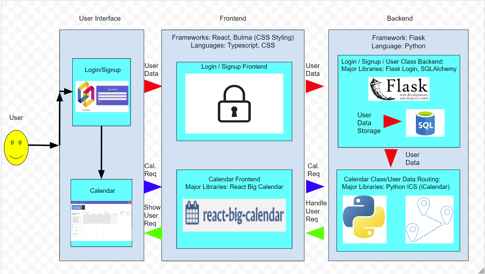

# CS222 Group-85 Project: CalendarAppify

This is an calendar app that allows used to signup and login to a personalized account where they can interact with a calendar interace to add, edit, and remove events that they'd like to keep track of using the app.

## Technical Architecture

Here is a diagram of the technical archecture setup for this project:



### Frontend

The frontend for this app is built using NextJs and typescript-based `.tsx` components.

We use the `ReactBigCalendar` library for the base of our calendar UI components. This is then layered with our own styling and custom interactions and backend link-ups

Testing for the app was done using the `jest` testing framework for react

### Backend

The backend for this app is built in Python using the Flask framework to handle frontend requests and database interactions for user data.

There are api request routes spread out into different Python files based on their functionality, and `SQLAlchemy` is used to communicated to the local `SQLlite` database used to store user information.

There is also a calendar class created in Python to encapuslate each individual user's events and a variety of methods to edit the calendar as need via a frontend interaction that triggers a api request.

## Getting Setup on Your Own Computer

The project is split between its frontend and backend, located on the `main` branch and `backendFinal` branch in GitHub respectively.

To run the frontend go to the `main` branch and run the following (make sure `npm` is installed)

```bash
npm install
npm run dev
```

To run the frontend go to the `backendFinal` branch and run the following (make sure python is installed)

```bash
cd backend
pip install -r requirements.txt
flask run
```

## Contributors

This was a project for CS222 with a group consistig of Aryan Mashruwla, Dhiraj Kuttichirayil, Kishan Challagulla, Soham Kulkarni.

Below are the distribution of work for project aspects:

| Aspect                   | Location | Members              |
| ------------------------ | -------- | -------------------- |
| Login/SignUp             | Backend  | Aryan, Dhiraj, Soham |
| Login/SignUp             | Frontend | Kishan               |
| Calendar Design          | Frontend | Dhiraj, Kishan       |
| Calendar Class Functions | Backend  | Dhiraj, Soham        |
| Calendar Interactions    | Frontend | Aryan                |
